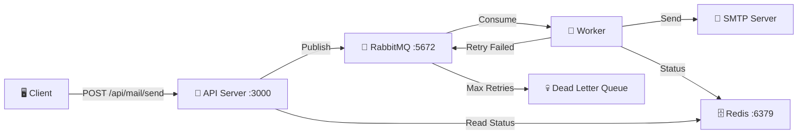

# 📨 Mail Queue Service - Docker Guide

## Kiến trúc



## Cấu trúc Project

```
mail_queue_service/
├── docker-compose.yml          # 4 services: RabbitMQ, Redis, API, Worker
├── Dockerfile                  # Node.js 20 Alpine
├── .env                        # Config SMTP, RabbitMQ, Redis
├── .dockerignore
├── package.json
└── src/
    ├── server.js               # Express API server
    ├── worker.js               # Queue consumer + email sender
    ├── config/
    │   ├── rabbitmq.js         # RabbitMQ connection (auto-reconnect)
    │   ├── redis.js            # Redis connection
    │   └── queue.config.js     # Queue names, retry config
    └── services/
        ├── queue.service.js    # Publish/consume/status logic
        └── mail.service.js     # Nodemailer SMTP sender
```

## DATABASE SCHEMA

┌────────────────────┐       1       N       ┌────────────────────┐       N       1       ┌────────────────────┐
│      email         │ ───────────────────── │    email_sends     │ ───────────────────── │     mail_tasks     │
│____________________│                       │____________________│                       │____________________│

[ Client / Web ]
       │
       │ (1) Gửi yêu cầu (Kèm Idempotency-Key)
       ▼
[ API Server :3000 ] ◄──(2) Kiểm tra Spam / Trùng lặp──► [ Redis :6379 ]
       │                                                    (Chốt chặn)
       ├──► (3) Tạo task mới (status: 'pending') ─────┐
       │                                              ▼
       │ (4) Publish Task (gửi message)      [ PostgreSQL :5432 ]
       ▼                                     (Lưu trữ vĩnh viễn)
┌──────────────┐                                      ▲
│   RabbitMQ   │      (Quá số lần Retry)              │
│ (Main Queue) │ ──────────────────────┐              │
└──────────────┘                       ▼              │
       │                       ┌──────────────┐       │ (7) Update trạng thái
       │ (5) Consume           │  Dead Letter │       │     ('sent' / 'failed')
       ▼                       │  Queue (DLQ) │       │
[ Worker (Node) ]              └──────────────┘       │
       │                                              │
       │ (6) Send Mail                                │
       ▼                                              │
[ SMTP Server ] ──────────────────────────────────────┘


## Khởi chạy

### 1. Cấu hình `.env`

```env
SMTP_HOST=smtp.gmail.com
SMTP_PORT=587
SMTP_USER=your_email@gmail.com
SMTP_PASS=your_app_password       # App password, KHÔNG phải password thường
SMTP_FROM=your_email@gmail.com
```

### 2. Chạy Docker

```bash
# Khởi động tất cả services
docker-compose up -d

# Xem logs
docker-compose logs -f

# Chỉ chạy RabbitMQ + Redis (dev local)
docker-compose up -d rabbitmq redis
```

### 3. Dev local (không dùng Docker cho API/Worker)

```bash
# Chạy API server
yarn dev

# Chạy Worker (terminal khác)
yarn worker

# Chạy cả 2
yarn dev:all
```

## API Endpoints

### Health Check
```bash
GET http://localhost:3000/health
```

### Gửi Email
```bash
POST http://localhost:3000/api/mail/send
Content-Type: application/json

{
  "to": "recipient@example.com",
  "subject": "Hello from Queue",
  "html": "<h1>Xin chào!</h1><p>Email này được gửi qua queue.</p>"
}
```

### Gửi Bulk Email
```bash
POST http://localhost:3000/api/mail/send-bulk
Content-Type: application/json

{
  "emails": [
    { "to": "user1@example.com", "subject": "Hello 1", "text": "Content 1" },
    { "to": "user2@example.com", "subject": "Hello 2", "text": "Content 2" }
  ]
}
```

### Kiểm tra trạng thái
```bash
GET http://localhost:3000/api/mail/status/:messageId
```

> [!TIP]
> Response trả về `messageId` khi gửi. Dùng ID đó để track trạng thái: `queued` → `processing` → `sent` / `retrying` → `failed`

## Quản lý

| Lệnh | Mô tả |
|-------|--------|
| `docker-compose up -d` | Khởi động tất cả |
| `docker-compose down` | Dừng tất cả |
| `docker-compose down -v` | Dừng + xóa data volumes |
| `docker-compose logs -f worker` | Xem logs worker |
| `docker-compose restart worker` | Restart worker |

### RabbitMQ Management UI
- URL: `http://localhost:15672`
- User: `admin` / Pass: `admin123`

## Flow xử lý

1. **Client** gửi POST request → **API Server**
2. **API** validate → publish message vào **RabbitMQ** exchange
3. **API** lưu trạng thái `queued` vào **Redis** → trả `202 Accepted`
4. **Worker** consume message từ queue
5. **Worker** gửi email qua **SMTP**
   - ✅ Thành công → `ack` message, cập nhật Redis `sent`
   - ❌ Thất bại & retry < 3 → `ack` cũ, publish lại với `retryCount + 1`, delay 5s
   - 💀 Thất bại & retry >= 3 → `reject` → Dead Letter Queue, cập nhật Redis `failed`
