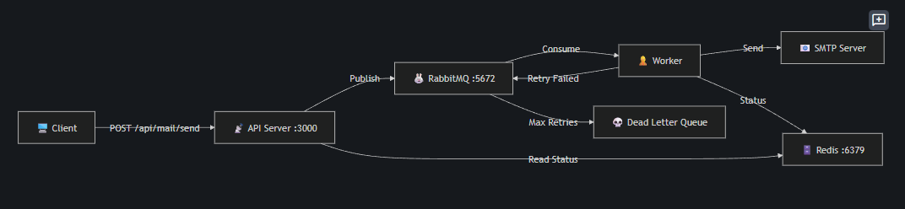

# MÔ HÌNH 3 TẦNG MAIL QUEUE SERVICE
                ┌────────────────────┐
                │   NodeJS Backend   │
                │  (API gửi thông báo)│
                └─────────┬──────────┘
                          │
                          ▼
                ┌────────────────────┐
                │  Queue System      │
                │  (Bull)            │
                └─────────┬──────────┘
                          │
                          ▼
                ┌────────────────────┐
                │     Redis          │
                │ (lưu hàng đợi mail)│
                └─────────┬──────────┘
                          │
                          ▼
                ┌────────────────────┐
                │   Worker (NodeJS)  │
                │  (lấy mail ra gửi) │
                └─────────┬──────────┘
                          │
                          ▼
                ┌────────────────────┐
                │   Nodemailer       │
                │ (SMTP client)      │
                └─────────┬──────────┘
                          │
                          ▼
                ┌────────────────────┐
                │     Postfix        │
                │ (SMTP relay + queue)│
                └─────────┬──────────┘
                          │
                          ▼
                ┌────────────────────┐
                │   cPanel SMTP      │
                │ (mail server thật) │
                └─────────┬──────────┘
                          │
                          ▼
                ┌────────────────────┐
                │ Nhân viên công ty  │
                └────────────────────┘

        ┌──────────────────────────────┐
        │        Database (DB)         │
        │  - lưu status               │
        │  - lưu email lỗi            │
        │  - tracking                 │
        └──────────────────────────────┘

